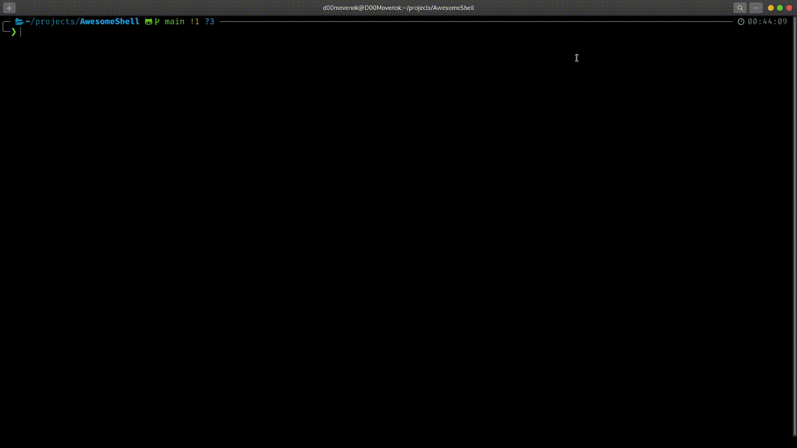
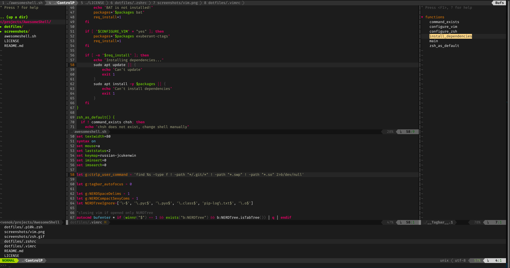
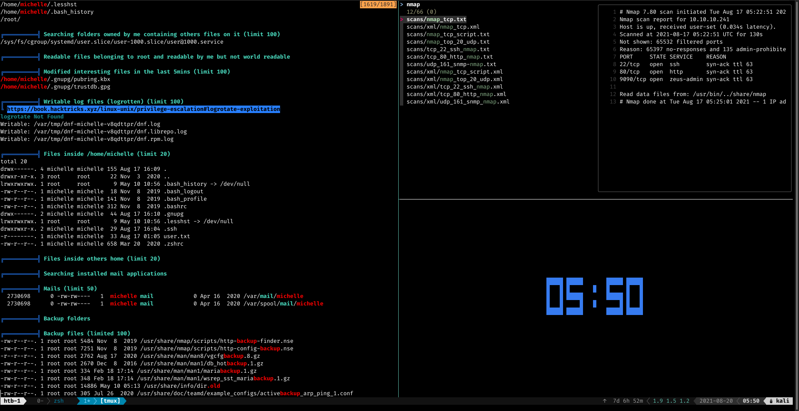

# AwesomeShell

💫 AwesomeShell install my [.zshrc](dotfiles/.zshrc), [.vimrc](dotfiles/.vimrc) and [.tmux.conf](dotfiles/.tmux.conf) with [plugins and themes](#plugins--themes) and [aditional utilities with zsh installation](#aditional-utilities-with-zsh-installation)

## Screenshots

ZSH:



VIM:



TMUX:



## Installation

**Warning:** this script use `apt` package manager, so only debian-based distributions supported

By default it will install and configure zsh, vim: and tmux

```sh
sh -c "$(curl -fsSL https://raw.githubusercontent.com/D00Movenok/AwesomeShell/main/awesomeshell.sh)"
```

Installation can be configured by arguments or env variables:

* `CONFIGURE_ZSH=yes` or `-z`: install and configure zsh
* `CONFIGURE_VIM=yes` or `-v`: install and configure vim
* `CONFIGURE_TMUX=yes` or `-t`: install and configure tmux

## Plugins & themes

ZSH:

* [git](https://github.com/ohmyzsh/ohmyzsh/tree/master/plugins/git) - provides many git [aliases](https://github.com/ohmyzsh/ohmyzsh/tree/master/plugins/git#aliases) and a few useful [functions](https://github.com/ohmyzsh/ohmyzsh/tree/master/plugins/git#functions)
* [colored-man-pages](https://github.com/ohmyzsh/ohmyzsh/tree/master/plugins/colored-man-pages) - adds colors to man pages
* [zsh-autosuggestions](https://github.com/zsh-users/zsh-autosuggestions) - fish-like fast/unobtrusive autosuggestions for zsh
* [zsh-syntax-highlighting](https://github.com/zsh-users/zsh-syntax-highlighting) - fish-like syntax highlighting for zsh
* [autoupdate](https://github.com/TamCore/autoupdate-oh-my-zsh-plugins) - auto updating of zsh plugins
* [powerlevel10k](https://github.com/romkatv/powerlevel10k) - theme

VIM:

* [scrooloose/nerdtree](https://github.com/scrooloose/nerdtree) - file system explorer
* [tpope/vim-surround](https://github.com/tpope/vim-surround) - mappings to easily delete, change and add such surroundings in pairs
* [jiangmiao/auto-pairs](https://github.com/jiangmiao/auto-pairs) - insert or delete brackets, parens, quotes in pair
* [majutsushi/tagbar](https://github.com/majutsushi/tagbar) - class and project outline viewer
* [python-mode/python-mode](https://github.com/python-mode/python-mode) - python autocomplete
* [powerline/powerline](https://github.com/powerline/powerline) - powerline for vim, tmux, etc.
* [rosenfeld/conque-term](https://github.com/rosenfeld/conque-term) - terminal split in vim
* [mitsuhiko/vim-jinja](https://github.com/mitsuhiko/vim-jinja) - jinja for Vim
* [kien/ctrlp.vim](https://github.com/kien/ctrlp.vim) - fuzzy file, buffer, mru, tag, ... finder
* [tomasr/molokai](https://github.com/tomasr/molokai) - theme

TMUX:

* [powerline/powerline](https://github.com/powerline/powerline) - powerline for vim, tmux, etc.

## Custom hotkeys

VIM:

* \<C-n> - Open or hide NERDTree
* \<F8> - Open or hide tagbar
* \<F5> - run (only python and c/cpp (make))
* \<leader>8 - PEP8 lint

ZSH

* \<?> - Open or hide fzf preview

## Aditional utilities with zsh installation

* [BAT](https://github.com/sharkdp/bat) - cat with syntax highlight
* [FZF](https://github.com/junegunn/fzf) - fuzzy finder
